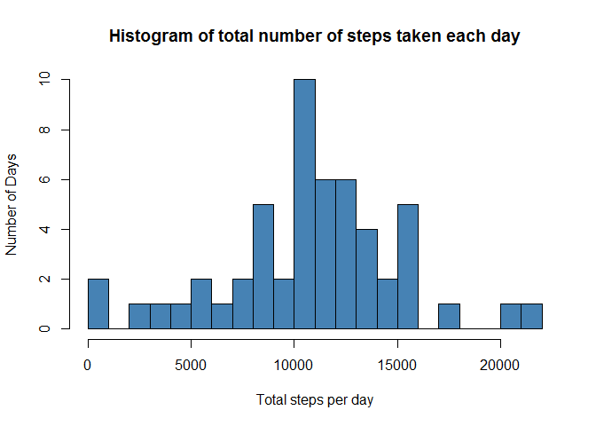
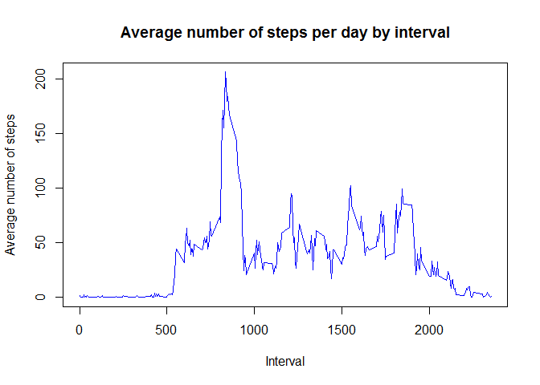
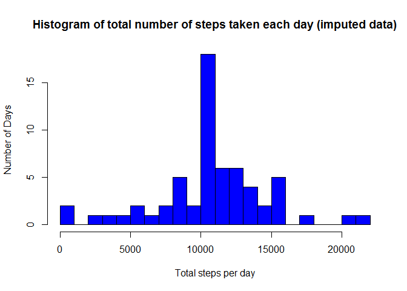
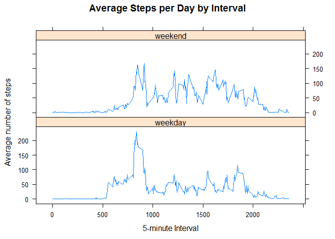
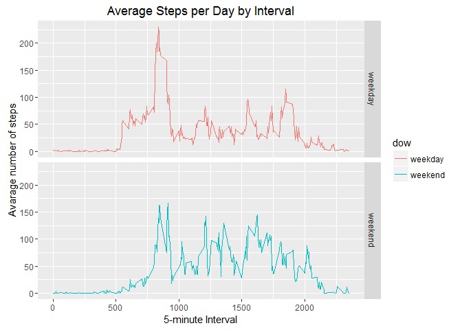

# Reproducible Research: Peer Assessment 1


### Loading and preprocessing the data
#### 1. Unzip and load data in a data frame

```r
if(!file.exists('activity.csv')){
    unzip('activity.zip')
}
activityData <- read.csv('activity.csv')
```

#### 2. Create a subset DF by removing NA entries

```r
activityData.NoNA <- subset(activityData, is.na(activityData$steps) == FALSE)
```


### What is mean total number of steps taken per day?
#### 1. Calculate the total number of steps taken per day

```r
TotalStepsPerDay <- aggregate(steps ~ date, activityData.NoNA, sum)
```

#### 2. Histogram of total number of steps taken each day

```r
hist(TotalStepsPerDay$steps, breaks = 20, col = "steelblue", main="Histogram of total number of steps taken each day", xlab="Total steps per day", ylab = "Number of Days")
```

<!-- -->

#### 3. Calculate the mean and median of the total number of steps taken per day

```r
rmean <- mean(TotalStepsPerDay$steps)
rmedian <- median(TotalStepsPerDay$steps)
```

The `mean` is 1.0766189\times 10^{4} and the `median` is 10765.


### What is the average daily activity pattern?
#### 1. Calculate average steps for each interval for all days

```r
AvgStepsByInterval <- aggregate(steps ~ interval, activityData.NoNA, mean)
```

#### 2. Make a time-series plot (i.e. type="l")

```r
plot(AvgStepsByInterval$interval, AvgStepsByInterval$steps, type = "l", col="blue ",xlab = "Interval", ylab = "Average number of steps", main = "Average number of steps per day by interval")
```

<!-- -->

#### 3. Which 5-minute interval, on average across all the days in the dataset, contains the maximum number of steps?

```r
max5minInterval <- AvgStepsByInterval[which.max(AvgStepsByInterval$steps), ]
```

The 5-minute interval, on average across all the days in the dataset, containing the maximum number of steps is 835.


### Imputing missing values
#### 1. Calculate total number of missing values in the datasets

```r
missingRecords <- sum(!complete.cases(activityData))
```

Total number of missing values in the 'Activity' dataset is 2304.

#### 2. My strategy to populate missing NA value is by filling it with its average 5-minute interval value. As part of this process I will also create a new dataset with all the NA values filled with some value.

```r
activityData.imputed <- activityData

for (i in 1:nrow(activityData.imputed)) {
    if(is.na(activityData.imputed$steps[i])){
        activityData.imputed$steps[i] <- AvgStepsByInterval$steps[which(activityData.imputed$interval[i] == AvgStepsByInterval$interval)]
    }
}

head(activityData.imputed)
```

```
##       steps       date interval
## 1 1.7169811 2012-10-01        0
## 2 0.3396226 2012-10-01        5
## 3 0.1320755 2012-10-01       10
## 4 0.1509434 2012-10-01       15
## 5 0.0754717 2012-10-01       20
## 6 2.0943396 2012-10-01       25
```

```r
sum(is.na(activityData.imputed))
```

```
## [1] 0
```

#### 3. Make a histogram of the total number of steps taken each day and calculate and report the mean and median total number of steps taken per day.


```r
TotalStepsPerDay.imputed <- aggregate(steps ~ date, activityData.imputed, sum)

hist(TotalStepsPerDay.imputed$steps, breaks = 20, col = "blue", main="Histogram of total number of steps taken each day (imputed data)", xlab="Total steps per day", ylab = "Number of Days")
```

<!-- -->

```r
rmean.imputed <- mean(TotalStepsPerDay.imputed$steps)
rmedian.imputed <- median(TotalStepsPerDay.imputed$steps)
```

The `mean` with NO missing data is 1.0766189\times 10^{4} and the `median` with NO missing data is 1.0766189\times 10^{4}.
The `mean` with missing data is 1.0766189\times 10^{4} and the `median` with missing data is 10765.

So, after imputing the missing data, the new mean of total steps taken per day is the SAME as that of the old mean; the new median of total steps taken per day is slightly GREATER than that of the old median.

### Are there differences in activity patterns between weekdays and weekends?
#### 1. Create a new factor variable in the dataset with two levels - "weekday" and "weekend" indicating whether a given date is a weekday or weekend day.

```r
activityData.imputed$dow <-  ifelse(as.POSIXlt(activityData.imputed$date)$wday %in% c(0,6), 'weekend', 'weekday')

head(activityData.imputed)
```

```
##       steps       date interval     dow
## 1 1.7169811 2012-10-01        0 weekday
## 2 0.3396226 2012-10-01        5 weekday
## 3 0.1320755 2012-10-01       10 weekday
## 4 0.1509434 2012-10-01       15 weekday
## 5 0.0754717 2012-10-01       20 weekday
## 6 2.0943396 2012-10-01       25 weekday
```

#### 2. Make a panel plot containing a time series plot

```r
AverageActivityData.imputed <- aggregate(steps ~ interval + dow, activityData.imputed, mean)

library(lattice)

xyplot(AverageActivityData.imputed$steps ~ AverageActivityData.imputed$interval|AverageActivityData.imputed$dow, main="Average Steps per Day by Interval",xlab="5-minute Interval", ylab="Average number of steps",layout=c(1,2), type="l")
```

<!-- -->

```r
library(ggplot2)
```

```
## Warning: package 'ggplot2' was built under R version 3.2.5
```

```r
ggplot(AverageActivityData.imputed, aes(interval, steps, color = dow)) + 
    geom_line() + 
    facet_grid(dow ~ .) +
    xlab("5-minute Interval") + 
    ylab("Avarage number of steps") + ggtitle("Average Steps per Day by Interval")
```

<!-- -->
